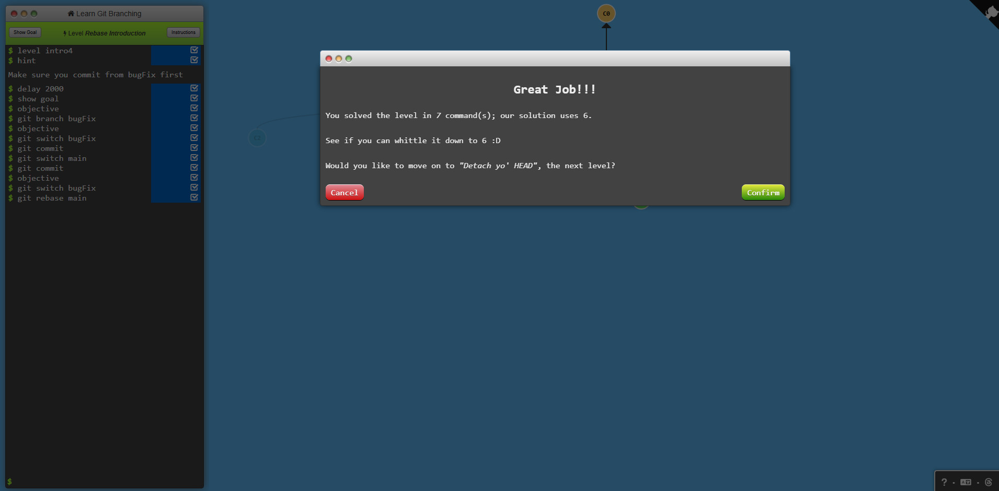

## Level 1
# 1.1 (คำสั่งที่ใช้ git commit)

# 1.2 (คำสั่งที่ใช้ git switch git branch)

# 1.3 (คำสั่งที่ใช้ git commit git branch git switch git merge)

# 1.4 (คำสั่งที่ใช้ git commit git branch git switch git rebase)
